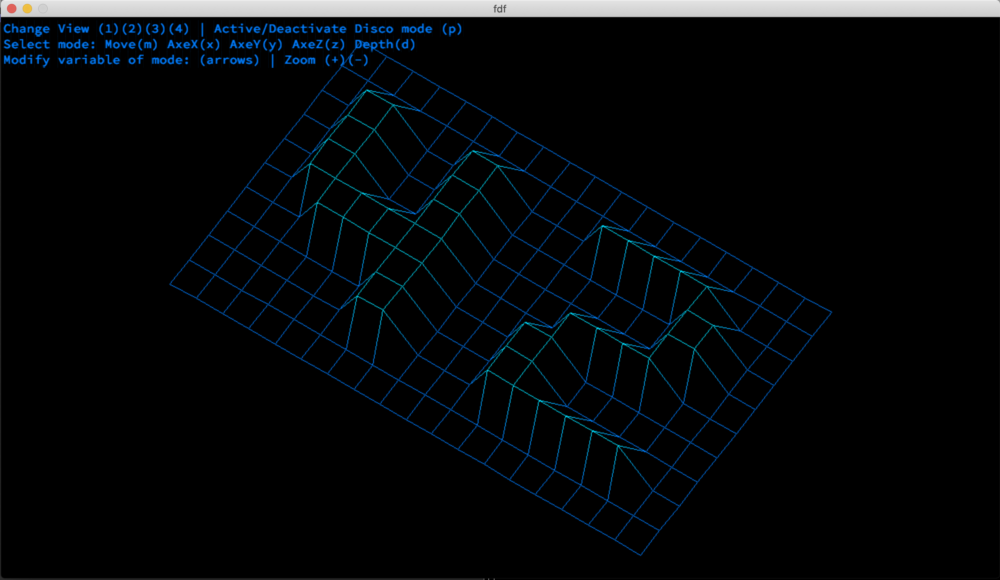

FDF

This project is about creating a simplified 3D graphic representation of arelief landscape linking various points(x, y, z)via segments. The coordinates of this landscape are stored in a file passed as parameter to the program. 

Here is a map example: [a relative link](./text)

