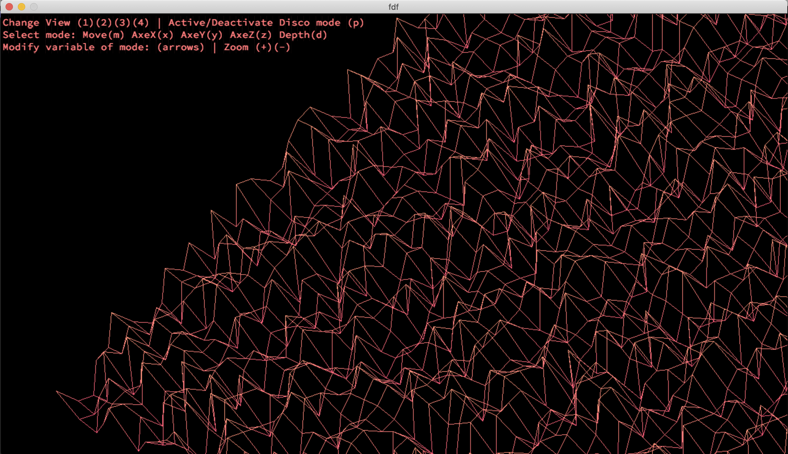
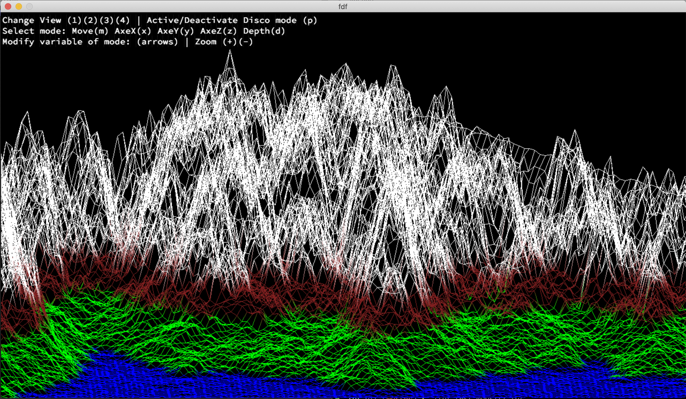

# FDF

This project is about creating a simplified 3D graphic representation of a relief landscape linking various points (x, y, z) via segments.
The coordinates and colors of this landscape are stored in a file passed as a parameter to the program.

Here is a map example: [42.fdf](map_examples/42.fdf)

__NOTE:__
The whole project was realized using the school's graphic library: MinilibX.
This library contains only basic drawing functions: open a window, lit a pixel and manage events.
Everything else has to be coded by students. (ex. file parsing, pixel coloring, rotations...).

Realized bonus:
- If the maps does not contain color information, the color changes according to altitude.
- The color spectrum can be specified as a parameter.
- Possibility to change types of projection and rotations in real time.
- Altitude can be modified in real time.

_If you are interested in the complete code, please do not hesitate to contact me._
